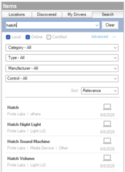

<!-- Copyright 2026 Finite Labs, LLC. All rights reserved. -->

______________________________________________________________________

# Overview

> DISCLAIMER: This software is neither affiliated with nor endorsed by either
> Control4 or Hatch.

This suite brings Hatch sleep devices into Control4. It controls the sound
machine and RGB night light on Hatch Rest+ and Restore devices through the Hatch
cloud, with no separate bridge or Home Assistant instance required.

The suite is split into an account driver and per-function companion drivers.
The account driver owns a single cloud connection for the whole account (Hatch
login, then AWS IoT over an MQTT-over-WebSocket link to the device shadows),
discovers the devices on the account, and exposes a connection for each device
function. The companion drivers present those functions to Control4: the sound
machine as a media service with a room audio endpoint, and the night light as a
standard light. This keeps one connection per account no matter how many devices
or rooms are involved.

# Index

- [System Requirements](#system-requirements)

- [Included Drivers](#included-drivers)

  - [Hatch](#hatch)
  - [Hatch Sound Machine](#hatch-sound-machine)
  - [Hatch Night Light](#hatch-night-light)
  - [Hatch Volume](#hatch-volume)

- [Installer Setup](#installer-setup)

  - [Installing the Drivers](#installing-the-drivers)
  - [Driver Setup](#driver-setup)
    - [Driver Properties](#driver-properties)
    - [Driver Actions](#driver-actions)

- [Support](#support)

- [Changelog](#changelog)

# System Requirements

- Control4 OS 3.3+
- A Hatch account (the email and password used in the Hatch mobile app)
- One or more supported Hatch devices already set up in the Hatch app: Rest+
  (Rest+ 2nd gen / riot) and Restore

# Included Drivers

## Hatch

The account driver, and the driver to add first. Enter your Hatch account email
and password and it connects to the Hatch cloud, discovers the devices on the
account, and creates a connection for each device function. The sound machine
and night light drivers bind to those connections, so the account driver is the
only place credentials are entered and the only cloud connection that is opened.

**Key features:**

- One cloud connection for the whole account, shared by every device and room
- Automatic discovery of the devices on the account
- Live device state (playback, volume, light color and brightness) kept in sync
  from the Hatch device shadows
- Reconnects on its own after a network drop or controller restart

## Hatch Sound Machine

Presents one device's sound machine as a Control4 media service with its own
room audio endpoint, so it behaves like any other listening source.

**Key features:**

- Browse and play the device's sounds and favorites from the room
- Now-playing, stop, and volume in the standard Control4 listening session
- Play Sound, Play Favorite, and Stop programming commands
- Adds itself as a room audio endpoint, so no external amplifier is needed

## Hatch Night Light

Presents one device's RGB night light as a standard Control4 light (light_v2).

**Key features:**

- On, off, brightness, and full color from the light UI and from programming
- Color handled with Control4's built-in color model, so it matches the rest of
  the lighting in a project
- Advanced Lighting Scenes support

## Hatch Volume

Presents one device's sound machine volume as a standard Control4 light
(light_v2) dimmer, where brightness is the volume percentage and the load being
on means the sound machine is playing.

**Key features:**

- Volume as a dimmer, for integrations that only understand lights. Apple Home
  has no equivalent of a media service, so this is the only way to put Hatch
  volume in front of it
- Turning it on starts a sound or favorite chosen in a property, so the button
  always plays something
- Tracks changes made in the Hatch app in both directions, with no programming

> **Note:** This is redundant in native Control4, where the Hatch Sound Machine
> already carries volume in the room's audio session. Add it only for a
> lights-only integration.

# Installer Setup

## Installing the Drivers

1. Download the latest `control4-hatch.zip` from
   [Github](https://github.com/finitelabs/control4-hatch/releases/latest).

1. Extract and install the desired `.c4z` driver files.

1. Use the "Search" tab in Composer Pro to find the driver by name and add it to
   your project.

   

## Driver Setup

Add the Hatch account driver first and enter your account credentials, then add
the companion drivers for the device to the room it is in and bind each to the
matching connection on the account driver.

1. Add the **Hatch** account driver to your project.
1. Enter your Hatch account **Email** and **Password**. The driver connects to
   the Hatch cloud and populates **Connection Status** and the discovered
   **Devices**.
1. Add a **Hatch Sound Machine**, **Hatch Night Light** and/or **Hatch Volume**
   to the room with the device, and bind each one's `Hatch Device` connection to
   the matching device connection exposed by the account driver.

Each companion driver includes its own documentation accessible from within
Composer Pro. Refer to the individual driver documentation for its property,
connection, and programming reference.

### Driver Properties

#### Cloud Settings

##### Automatic Updates \[ Off | **_On_** \]

Enables or disables automatic driver updates. Default is `On`.

##### Update Channel \[ **_Production_** | Prerelease \]

Selects which release channel automatic updates pull from. Default is
`Production`.

#### Account Settings

##### Email

Email address for your Hatch account (the one used in the Hatch mobile app).

##### Password

Password for your Hatch account.

##### Connection Status (read-only)

Displays the current status of the connection to the Hatch cloud.

##### Devices (read-only)

Lists the Hatch devices discovered on the account. Bind the companion drivers
(Hatch Sound Machine, Hatch Night Light, Hatch Volume) to these device
connections.

#### Driver Settings

##### Driver Status (read-only)

Displays the current status of the driver.

##### Driver Version (read-only)

Displays the current version of the driver.

##### Log Level \[ 0 - Fatal | 1 - Error | 2 - Warning | **_3 - Info_** | 4 - Debug | 5 - Trace | 6 - Ultra \]

Sets the logging level. Default is `3 - Info`.

##### Log Mode \[ **_Off_** | Print | Log | Print and Log \]

Sets the logging mode. Default is `Off`.

### Driver Actions

#### Update Drivers

Checks for and installs the latest driver versions from the configured Update
Channel.

#### Reconnect

Drops and re-establishes the connection to the Hatch cloud.

#### Reset Driver

Clears the driver's stored state and reconnects.

**Parameters:**

- **Are You Sure?** \[ **_No_** | Yes \] - Confirmation to reset the driver.

# Support

If you have any questions or issues integrating these drivers with Control4, you
can file an issue on GitHub:

https://github.com/finitelabs/control4-hatch/issues/new

# Changelog

<!--
Template for a new release entry (copy below the heading, fill in, uncomment):

## v[Version] - YYYY-MM-DD

### Added
- Added

### Fixed
- Fixed

### Changed
- Changed

### Removed
- Removed
-->

## v20260816 - 2026-08-16

### Added

- Added the Hatch Volume driver, presenting a device's volume as a dimmer for
  integrations that only understand lights, such as Apple Home.
- Added a Turn On Plays property to Hatch Volume, choosing what turning it on
  starts. A favorite starts at its own volume, a sound at the Default On level.
- Added Started Playing and Stopped Playing events to the Hatch Sound Machine,
  which also fire for playback started from the Hatch app or the device itself.
- Added Programming conditionals to the Hatch Sound Machine for whether it is
  playing, and for which sound or favorite is playing.
- Sounds and favorites now refresh on their own when they change in the Hatch
  app, with no driver reload.
- The Hatch Sound Machine now behaves as a normal room source: starting it takes
  the room, and selecting another source stops it.

### Fixed

- Fixed a reconnect or credential change on the account driver briefly reporting
  its companion drivers as disconnected, and a deliberate stop being reported as
  a disconnect.
- Fixed the Hatch Night Light never reporting itself online, which could leave
  it greyed out and unusable in Navigator.
- Fixed stopping the sound machine turning off the whole room, which ended a
  video session in rooms with a TV.
- Fixed a second room off being sent behind the one you pressed, which could
  switch a TV with a power toggle back on.
- Fixed starting the sound machine from the device itself taking a room the TV
  was holding, which switched a TV with a power toggle back on. It now takes a
  room only when you start it from Control4.
- Fixed Hatch Volume listing favorites that share a name as identical entries,
  where choosing either one started the first. Repeats now carry their touch
  ring number, matching the Hatch app.
- Fixed the sound machine reporting its volume continuously rather than only
  when it changed, which made Programming watching the volume run constantly.
- Fixed the companion drivers showing their last known state as though it were
  live after the account driver lost its cloud connection. The sound machine's
  now-playing card and Programming conditionals also went stale, and the night
  light and volume dimmer reported themselves reachable before the account
  driver had found the device.

## v20260806 - 2026-08-06

### Added

- **Hatch** account driver. Signs in to the Hatch cloud, discovers the devices
  on the account, and holds a single AWS IoT connection (MQTT over WebSocket to
  the device shadows) shared by every device and room. Reconnects on its own
  after a network drop or controller restart, reusing the member token.
- **Hatch Sound Machine** companion. Presents a device's sound machine as a
  Control4 media service with its own room audio endpoint, so no external
  amplifier is needed. Browse and play sounds and favorites, now-playing with
  cover art, volume and mute in the standard listening session.
- **Hatch Night Light** companion. Presents a device's RGB night light as a
  standard Control4 light, with on/off, brightness, full color and Advanced
  Lighting Scenes support.
- Play Sound, Play Favorite and Stop programming commands, with sound and
  favorite lists populated from the device's own catalog.
- Cover art on both the now-playing card and the browse lists, resolved per
  sound and shared with favorites through the sound their routine plays.
- Support for Rest+ (riot, riotPlus) and Restore (restoreV5). Restore sound
  content is read from Hatch's Contentful CMS, which the REST content endpoint
  does not serve.
